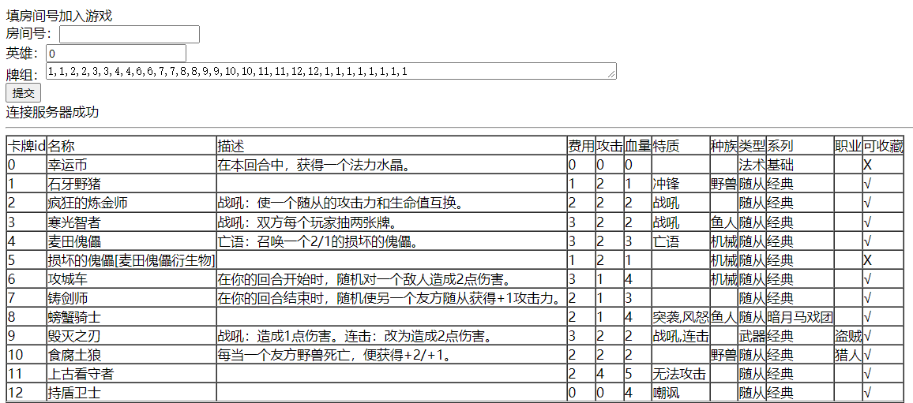
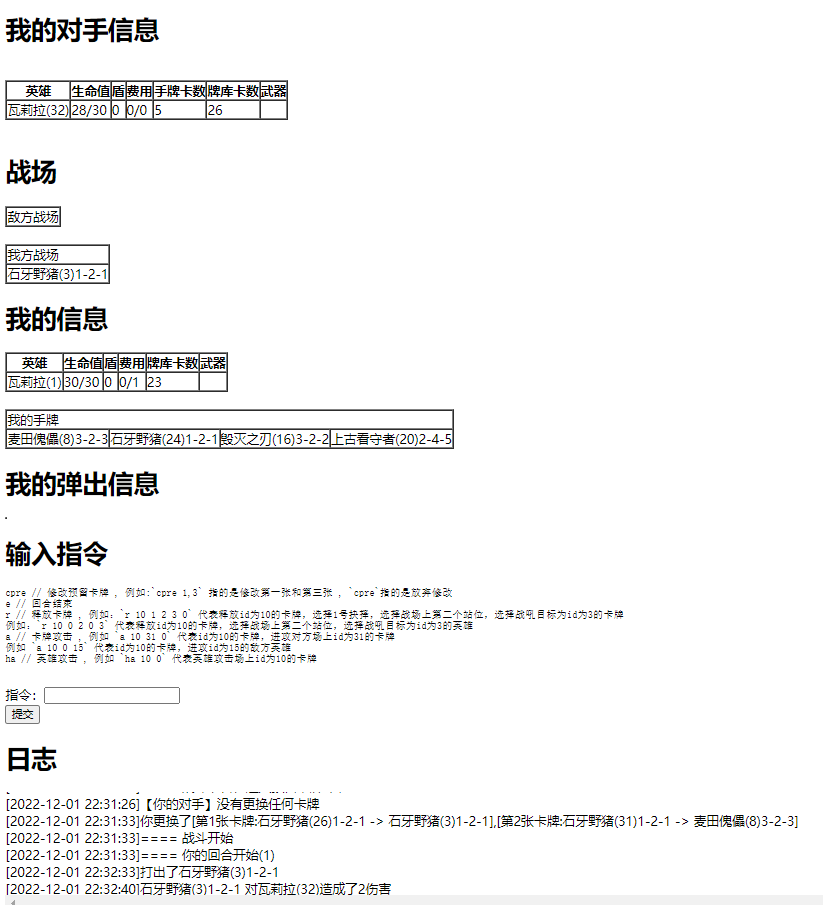

# hs
炉石传说，golang实现

Hearthstone by golang

## 使用

server: `go run main.go`

client：打开2个`client/client.html`

## 概览

## 已实现

- 选择预选卡
- 出卡
- 卡牌攻击
- 玩家攻击
- 回合结束

特质
- 冲锋（id：1 石牙野猪）
- 战吼（id：3 寒光智者）
- 亡语（id：4 麦田傀儡）
- 突袭（id: 8 螃蟹骑士）
- 风怒（id: 8 螃蟹骑士）
- 连击（id: 9 毁灭之刃）
- 无法攻击（id: 11 上古看守者）
- 嘲讽（id: 12 持盾卫士）
- 圣盾（id: 13 银色侍从）
- 潜行（id: 14 耐心的刺客）
- 剧毒（id: 14 耐心的刺客）

机制
- 回合开始时（id：6 工程车）
- 回合结束时（id：7 铸剑师）
- 抽牌（id：3 寒光智者）
- 召唤（id：4 麦田傀儡）
- 随机对敌人（id：6 工程车）
- 随机另一个友方随从（id：7 铸剑师）
- 本回合获得水晶（id：0 幸运币）
- 武器卡（id：9 毁灭之刃）
- 当另一个卡牌死亡时（id：10 食腐土狼）
- 随机对所有人（id：15 疯狂投弹者）
- 召唤一个随从后（id：16 飞刀杂耍者）
- 相邻的随从获得攻击力（id：17 火舌图腾）

## 卡牌实现

定义
- `logic/config/card.go`

实现
- `logic/cards/card1-100.go`
- `logic/cards/card_point.go`
